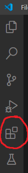
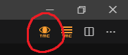

This is a quick guide to using the TestMyCode extension with Visual Studio Code to test C# exercises.

## Visual Studio Code

Visual Studio Code can be downloaded [here](https://code.visualstudio.com/download).

## Installing the TMC extension

 

After opening vscode, extensions can be added through the extensions menu, which is opened with a button on the left side of the screen (circled in red in the image).
If the sidebar is missing, it can be brought back by pressing F1, typing “activity bar” and hitting enter on the option that says “View: Toggle Activity Bar Visibility”. 
Alternatively the extensions menu can be opened with ctrl+shift+X (cmd+shift+X on mac). After installing the extension the regular file explorer can be brought back up with ctrl/cmd+shift+E.

In the extensions menu, type “testmycode” in the search field and the TMC extension will be brought up. Click it and click install to add the extension to vscode. No further setup should be needed.

## Using the TMC extension

Installing the TMC extension will add an extra button on the left side activity bar. Again, if the activity bar is hidden, it can be brought back by pressing F1, typing “activity bar” and hitting enter on the option that says “View: Toggle Activity Bar Visibility”. Clicking on the TMC button brings up the extension’s menu. 

First you should log in with your TMC account. If you do not have an account, you can create one [here](https://www.mooc.fi/en/sign-up). After logging in you can click ’My courses’ and ‘Add new course’ to download exercises. Select the correct organization and click on a course to add it to your courses. After this you can click on the course and ‘Download exercises’ to bring up a list of exercises in the course. Select the ones you want to download and click ‘Download selected’. The downloaded exercises can be opened with the ‘Open exercise workspace’ button.

 

After writing your code in an exercise, you can test it with TMC by pressing the eye symbol in the top right corner. If the tests pass you are given a button to submit your solution to the TMC server. If the tests also pass on the server, you will be awarded points for the exercise. Partial points are also awarded for partially correct exercises, so if you want to submit an exercise where not all test are correct, you can do so by clicking the menu button next to the eye symbol and selecting “Submit to server”.
